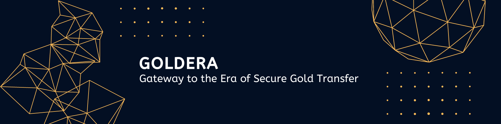

# GOLDERA

## Idea
We are proposing a new system for gold exchange in India. The proposed system is an end-to-end digital process anchored on linking **Aadhar IDs and Hallmark Unique Identification number(HUID)**. Our system prioritizes security through advanced encryption and **Blockchain technology**, ensuring airtight protection for all transactions and data. Additionally, we emphasize transparency by providing users with clear visibility into ownership verification and purity assessment processes, fostering trust and reliability in the gold exchange ecosystem. We hope this project could build an entirely new ecosystem for the gold transactions in India..

## Features
1. **Aadhar-HUID Linkage:** The jewellery owners and bank can associate their HUIDs with Aadhar IDs during the selling process to ensure transparency and traceability.

2. **Blockchain Security:** Blockchain technology has been used for secure and immutable ownership records, ensuring the authenticity and integrity of gold assets.

3. **Transparent Ownership Verification:** The system enables easy and transparent verification of ownership for banks and loan providers by accessing HUID-linked data.

4. **Purity Assessment:** The system allows for precise assessment of gold purity, aiding in accurate valuation and lending decisions using the data collected from XRF machines.

5. **Reduction in Gold Smuggling and other related crimes:** Linking of Aadhar ID with HUID reduces the risk of gold smuggling by creating a digital trail for all gold transactions and complete transparency regarding their ownership.

6. **Transparency and Purity Assurance:** The system's transparency and purity assurance features plays a vital role in fostering trust and confidence among users.

7. **Fast Gold Loan Processing:** The system facilitates faster processing of gold loans by providing instant access to verified ownership and purity information.

8. **Quick Victim Redressal:** System  facilitates the identification of the rightfull owner of the gold in case of theft and recovery, making the job easier for the Court/Police.

9. **Efficient Gold Exchange and selling:** The system streamlines the exchange of gold assets from jewellery, making transactions quicker and more efficient.

10. **Web3 Technologies Integration:** The system is built on Ethereum blockchain.

11. **Complete Transaction History:** The system helps to mainatain complete records regarding the ownership and transaction of the gold ornament.

12. **Trustworthy Environment:** The system creates a trustworthy and transparent environment for handling gold, ensuring a reliable platform for all stakeholders.

## Demo video
[link to video](https://drive.google.com/file/d/1lpWhkqe-kuYUxST-bJcRVHx1Gfy7N7o1/view?usp=sharing)

## Scope Of Contribution
1. Extend the platform's capabilities to support cross-border trading of gold assets, integrating with global marketplaces and complying with international regulations.
2. Implement data analytics tools to analyze trends, patterns, and user behavior within the gold exchange platform, offering valuable insights for decision-making and optimization.
3. Explore the use of artificial intelligence (AI) algorithms to automate and improve the accuracy of gold purity assessment, providing real-time results to users.
